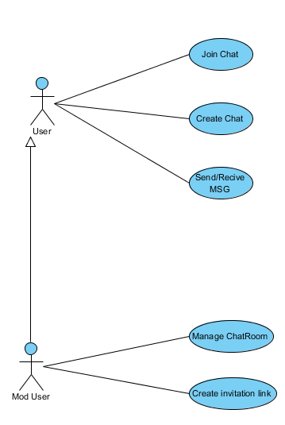
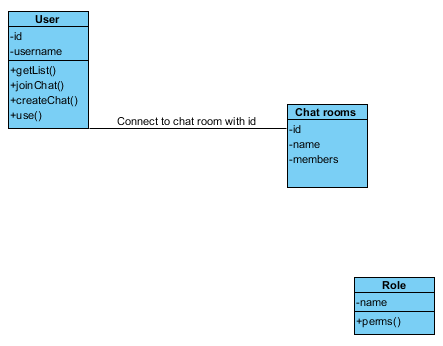
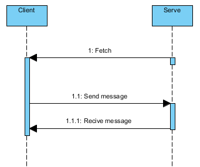
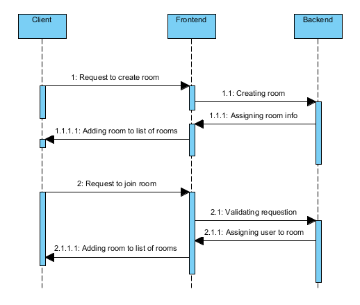

# YellowDucky Chat

# Diagrames 
## Cas d'utilisation (use case) :

## Class Diagram :
 

## Sequence Diagram :
### envoyer les messages 
 

### Créer et rejoindre (chatroom) 
 

# Architecture
## Tiers : 
3 tiers. Il y aura le U.I, le backend et la base de donnes.

## Schema conceptuel (U.I, BackEnd, BigData) : 

## Systemes : 
* 1 server (VMware)
  * Angular2
  * MongoDB
  * WebSocket
  * Docker
  
