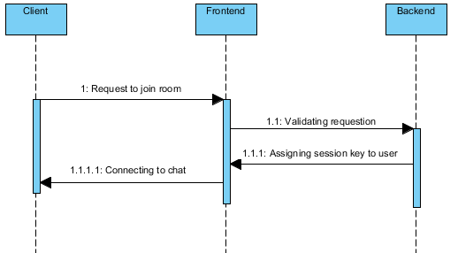

# YellowDucky Chat

# Diagrammes 
## Cas d'utilisation (use case) :

## Diagramme de classe (Class Diagram) :
 

## Diagramme de séquence (Sequence Diagram) :
### Connecter au chatroom 
 

### Envoyer les messages 
 

# Architecture
## Tiers : 
3 tiers. Il y aura le U.I, le backend et la base de donnes.

## Schema conceptuel (U.I, BackEnd, BigData) : 
* UI l'interface pour envoyer et recevoir les messages
* Backend pour envoyer les donnees en direct avec Websocket
* Base de donnees stock tous les messages

## Systemes : 
* 1 server (VMware & AWS EC2)
  * Angular2
  * MongoDB
  * WebSocket
  * Docker
  
  ## Repo
  https://github.com/LiebelJ/YellowDuckyChat
  
  ## Site
  http://aws.yellowducky.co:8080  
  https://aws.yellowducky.co:9443
